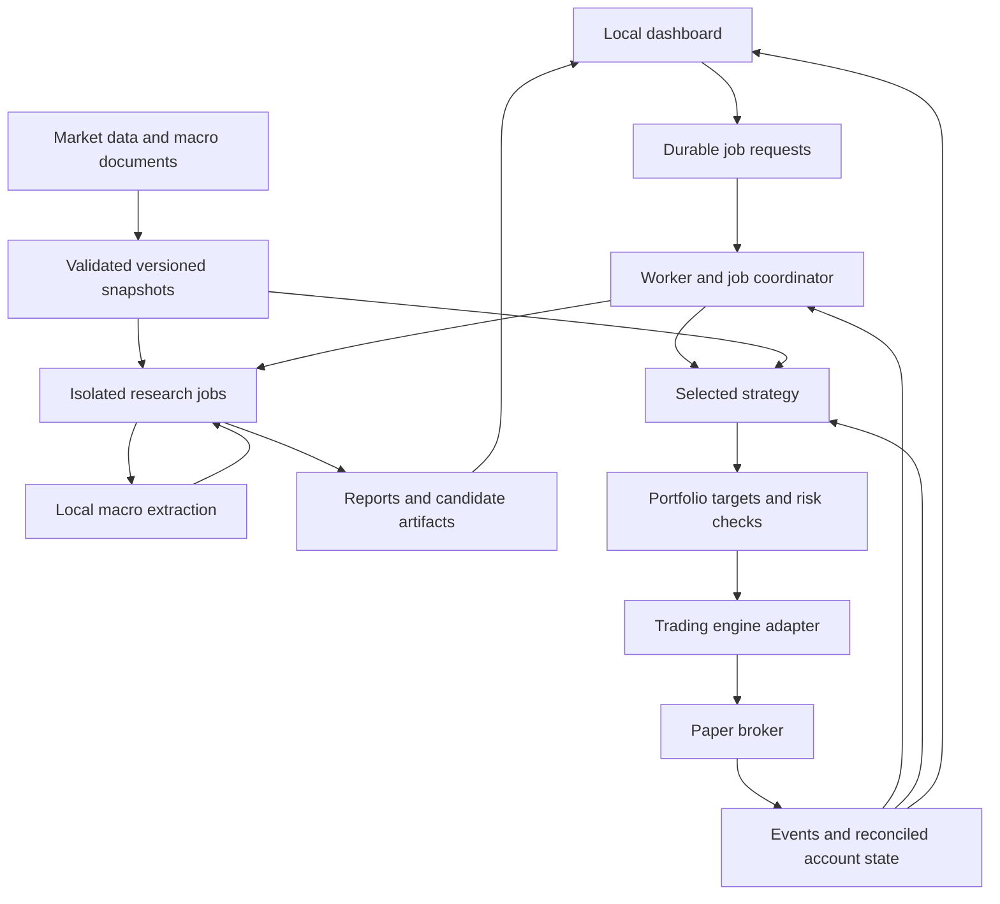

# BuffetBot North Star

**Status:** Product direction reviewed by the owner.  
**Created:** September 7, 2026.  
**Current phase:** Initial implementation. BB-001 through [BB-004](docs/development/04-dataset-snapshots.md) are complete; the [MVP backlog](docs/development/README.md) tracks remaining implementation.

This is BuffetBot's guiding product and architecture document. It governs implementation scope and design decisions. The [development backlog](docs/development/README.md) turns the direction into executable stories and release criteria. The [MVP technical design](docs/mvp-technical-design.md) provides supporting detail; the [build proposal and wargame](docs/build-proposal.md) preserves research and earlier alternatives. If those documents conflict with this one, update them to reflect this direction. Subsequent owner decisions take precedence and should be recorded here.

Everything described below is planned unless explicitly marked as verified. The local Python foundation, configuration/doctor command, redacted logging, and initial tests are implemented with [BB-001 evidence](docs/development/evidence/BB-001.md). [BB-002 evidence](docs/development/evidence/BB-002.md) qualifies Lumibot with synthetic backtests, a saved numerical-model probe and local broker transport tests. [BB-003 evidence](docs/development/evidence/BB-003.md) verifies the shared contracts and experiment identity layer. [BB-004 evidence](docs/development/evidence/BB-004.md) verifies immutable market snapshots, quality checks and offline fixtures. Actual provider ingestion, production strategies/model workflows, broker connections and the dashboard remain unimplemented.

## 1. What we are building

BuffetBot is a local application for developing, comparing, and eventually operating autonomous trading strategies. It combines quantitative algorithms, numerical machine learning, and LLM analysis of financial documents in a reusable research and execution platform.

Its long-term purpose is to discover and operate strategies with a repeatable advantage after costs, improve them through controlled experimentation, and help its owner learn machine learning, model fine-tuning, and market behavior. Profits are never guaranteed; investment performance remains a question to test with evidence.

The first product is a usable trading laboratory with a browser dashboard and a reliable paper trading workflow. The eventual product can update its understanding of market conditions, adjust allocations within a validated policy, train replacement models, and promote qualifying versions under a tested release process.

The primary user is the owner acting as researcher, developer, and trading operator. The architecture should remain understandable and maintainable by one person.

## 2. What success means

We measure three outcomes separately:

| Outcome | Evidence of progress |
| --- | --- |
| Research and learning | Reproducible experiments, explicit hypotheses, useful model comparisons, and explanations tied to data |
| Software reliability | Correct accounting, repeatable decisions, observable operation, tested recovery, and enforced execution limits |
| Investment performance | Results after costs compared with appropriate benchmarks on unseen and prospective observations, with uncertainty and drawdowns reported |

The MVP succeeds when the owner can move from a strategy idea to a reproducible comparison, inspect why decisions occurred, train a candidate model, and operate one selected strategy in a paper account. Rejecting a strategy or finding that an LLM adds no value is a valid research result.

Software acceptance does not require a profitable backtest. A profitable backtest does not establish readiness for live capital.

## 3. Product principles

1. **Evidence determines complexity.** Establish simple controls, then measure the incremental contribution of every model or allocation rule.
2. **Use only information available at the decision time.** Availability timestamps, historical revisions, execution timing, and model training cutoffs are part of the experiment.
3. **Share decision logic across modes.** Backtests, shadow portfolios, and paper execution use the same strategy and risk interfaces, with explicit differences in execution assumptions.
4. **Keep execution authority explicit.** Strategies and LLMs provide inputs and targets. Tested portfolio and execution code enforce the permitted actions.
5. **Make every result inspectable.** Preserve data, configuration, code, models, prompts, decisions, orders, and evaluation artifacts.
6. **Make recovery part of normal operation.** Timeouts, missing data, partial fills, and restarts have defined behavior.
7. **Use available resources economically.** Prefer free software, local compute, cached data, and existing tools. Track external costs and data entitlements explicitly.
8. **Keep the application modular and small.** Use an established trading engine, replaceable adapters, one codebase, and infrastructure appropriate to a single operator. Choose the simplest design that meets correctness and stability requirements. Development time and available resources do not justify either cutting required behavior or adding unnecessary technical layers.

## 4. MVP scope

The initial defaults are US listed, liquid, unleveraged ETFs; daily observations; holdings lasting days or weeks; and long positions or cash. Decisions use completed sessions and execute during the next eligible session under a documented order convention. The initial universe and strategy parameters must be declared before evaluating performance.

The MVP includes:

- Historical price and macro data ingestion, validation, versioning, and an offline fixture dataset.
- A benchmark, a simple trading strategy, and comparisons with numerical and LLM-based adjustments.
- Backtests with explicit costs, corporate actions, trade ledgers, and performance reports.
- Local LLM extraction from macro documents with supporting evidence.
- One numerical model training workflow with chronological evaluation and versioned candidates.
- A local browser dashboard for experiments, macro evidence, candidate comparisons, and paper activity.
- One selected strategy operating through Alpaca paper trading, with persistence and recovery checks.
- Documented installation, configuration, tests, and container deployment.

Later capabilities include live execution, additional brokers and asset classes, multiple strategies sharing an account, language-model fine-tuning, automatic candidate promotion, and broader autonomous strategy research. High-frequency trading, leverage, derivatives, a hosted multi-user product, and unrestricted rewriting of the executing system are outside the first release.

MT5 remains a possible future adapter if the owner's market or broker preferences justify it. The default implementation path is Python and Alpaca paper trading.

## 5. How the application should feel

The owner should be able to complete four workflows:

| Workflow | User experience |
| --- | --- |
| Run an experiment | Choose a dataset snapshot, strategy, dates, and settings; run it; inspect the benchmark comparison and every trade |
| Understand macro inputs | Read the extracted assessment beside the original documents, timestamps, supporting passages, and uncertainty |
| Compare candidates | See what changed, how it performed on later data, what it costs to operate, and whether it qualifies for further evaluation |
| Operate paper trading | Inspect positions, outstanding orders, decisions, data freshness, account reconciliation, health, and pause status |

The dashboard must visibly distinguish historical simulations, synthetic demonstrations, shadow estimates, and broker paper results. It must expose stale data and incomplete jobs instead of displaying them as current or successful.

Product controls use plain language. Pausing new orders, cancelling pending orders, and liquidating positions have distinct meanings and must not be combined into an ambiguous control.

## 6. Technical stack

| Layer | Default choice | Responsibility |
| --- | --- | --- |
| Language and environment | Python 3.12, isolated environment, uv lockfile | Reproducible application and research environment |
| Trading engine | Lumibot 4.5.91, qualified in BB-002 with narrow corrections | Historical simulation and broker lifecycle behind an adapter |
| Broker | Alpaca paper account | External order and account integration |
| Analysis | pandas and NumPy | Data preparation, features, and numerical calculations |
| Historical storage | Parquet and DuckDB | Versioned analytical datasets and local queries |
| Operational storage | SQLite with transactions and migrations | Jobs, decisions, audit events, and candidate metadata |
| Data contracts | Pydantic plus domain validation | Validate external inputs, model outputs, timestamps, and bounds |
| User interface | Streamlit | Local experiment and operations dashboard |
| Language models | Ollama behind a provider interface | Local document extraction and future model comparisons |
| Numerical ML | scikit-learn | Simple estimators, preprocessing, and candidate training |
| Quality | pytest and Ruff | Meaningful behavior checks and consistent code |
| Deployment | Docker Compose with persistent local volumes | Repeatable dashboard and worker deployment |

The [BB-002 engine decision](docs/development/evidence/BB-002-engine-decision.md) adopts Lumibot 4.5.91 for the bounded MVP with demonstrated corrections for eligible feature access, dividend entitlement/payment and partial-order startup import. The native engine owns orders, fills, positions, fees and splits. The decision records its dependency/license findings and limits; actual paper behavior remains unverified until BB-017/018. Requalify upgrades. A replacement must preserve our strategy and data contracts; a failed compatibility test should not lead to building a general trading engine from scratch.

Earlier inspection verified that the development machine has approximately 64 GB RAM, two RTX 3090 GPUs with 24 GB each, Docker, and Ollama with existing models. These are available resources, not minimum product requirements or a model-performance benchmark. Start extraction evaluation with an installed general-purpose model and select the default from measured quality and runtime. Model weights and provider choices remain replaceable.

## 7. Architecture and ownership



Use one codebase with a dashboard process and a worker process. The worker coordinates scheduled tasks and durable job requests. Expensive research runs in isolated child processes so it cannot block order-event handling. The existing Ollama service supplies inference through an explicit local connection.

Only one active trading worker may submit broker orders. The dashboard submits uniquely identified requests; browser refreshes cannot duplicate execution. The trading engine owns the order lifecycle. Our adapter preserves engine and broker identifiers, records events, and reconciles account state without creating a competing order manager.

The shared strategy contract is:

```python
generate_targets(context) -> PortfolioTargets
```

The context contains information available at the decision cutoff, eligible instruments, configuration, current and pending exposure, and any validated model features. Targets specify instrument weights, timestamps, expiry, strategy version, and reason codes. They do not directly submit orders.

Portfolio and risk code convert targets into eligible order intentions using holdings, pending orders, buying power, instrument rules, and configured limits. Broker and model providers stay behind adapters so that research logic can survive a provider change.

Persist operational state and artifacts outside disposable containers. Keep credentials out of Git, logs, model prompts, and research process environments. Bind local interfaces locally by default. The MVP broker adapter accepts paper configuration only.

## 8. Data and research integrity

Use cached, versioned Alpaca historical data with explicit feed, interval, and adjustment settings. Begin macro analysis with official central-bank statements and a small collection of FRED/ALFRED series. Record the exact provider capabilities and entitlements during implementation; a free dataset is not assumed to have every field or coverage period we need.

Every experiment must identify:

- Instrument and universe definitions, listing periods, session calendars, and timezone conventions.
- Observation, publication/availability, and ingestion times as distinct concepts.
- Feed coverage, corporate-action treatment, missing data, revisions, and dataset hashes.
- Strategy settings, model and prompt versions, code revision, and evaluation dates.
- Execution timing, fees, spread/slippage assumptions, cash treatment, and benchmark construction.

Apply splits and dividends consistently to features, holdings, cash, and benchmarks. Raw prices and adjusted research series serve different purposes. Data gaps must not silently become executable observations. A universe chosen from today's surviving instruments carries selection limitations that must be disclosed in results.

Training, validation, and final evaluation follow time order across all instruments. Fit preprocessing on training data only. Remove training labels that overlap evaluation periods and wait until future outcomes are fully observed before using them as labels. Declare a bounded search space, keep failed trials, and avoid repeatedly tuning against the final evaluation period.

Reports include net return, benchmark return, exposure, drawdown and recovery, turnover, costs, trade count, and contributions by instrument and period. Include uncertainty and cost sensitivity where supported. Repeatable backtests replay saved model outputs; they do not silently rerun an LLM and produce different historical decisions.

Synthetic fixtures exercise the offline demonstration and accounting checks. Their results are clearly labelled and provide no evidence of a market advantage.

## 9. The hybrid strategy experiment

Start with a buy-and-hold control and a fixed moving-average trend rule. Compare three independently accounted portfolios using common capital, universe, data, and execution assumptions:

| Variant | Decision policy | Question |
| --- | --- | --- |
| A | Trend rule with fixed allocations | What does the simple strategy achieve? |
| B | A with a predefined numerical volatility adjustment | Does adapting exposure to measured conditions help? |
| C | B with a bounded adjustment based on LLM-derived macro features | Does document interpretation add value after costs? |

The mapping from macro features to allocations is an explicit research policy fixed before test evaluation. A convincing explanation from an LLM does not establish a profitable mapping. Run one selected strategy in the broker paper account; keep other prospective variants in separate shadow ledgers.

The initial language-model task is to compare central-bank statements and extract changes in policy language and stated concerns. Outputs must include source references, exact supporting passages, comparison document IDs, ambiguity or unknown status, expiry, and model/prompt versions. Check both schema validity and factual support using a small reviewed evaluation set.

The LLM interprets documents. Numerical models estimate measurable quantities. Portfolio code controls allocation and execution limits. Model outputs cannot grant additional permissions, change evaluation criteria, or access broker credentials. Treat external documents as data, including any embedded instructions.

Record prospective LLM assessments from the start. Historical tests using models whose training cutoffs cannot be audited remain exploratory because later-event knowledge can contaminate results.

## 10. Controlled improvement and eventual autonomy

Separate three forms of change:

1. **Observation updates:** ingest new information as it becomes available.
2. **Policy execution:** adapt allocations at configured decision times using the selected, validated policy.
3. **Policy improvement:** train or propose replacements and evaluate them separately before promotion.

The MVP implements a bounded numerical training job that saves a candidate with its preprocessing, feature schema, training cutoff, data version, settings, and evaluation results. Compare it against the current baseline on later data and record the complete experiment.

The candidate lifecycle is: created, evaluated, rejected or qualified for shadow evaluation, and eventually selected for execution. Each transition records its evidence and decision. The first release uses deliberate selection; automatic promotion is a later capability with its own tested criteria and rollback behavior.

Fine-tuning becomes useful when a specific task has enough labelled examples and a measured weakness. Begin language-model work with retrieval and prompt-based extraction, then compare fine-tuned candidates against that baseline. Updating current facts happens through ingestion; model training changes how those facts are processed.

The long-term aim is automated research and promotion within defined limits. The system proposing a change must not be able to rewrite the rules used to accept it or expand the capital it controls.

## 11. Operational requirements

Before paper integration is considered complete, verify that:

- Timed-out submissions are reconciled before retrying; an unknown order state does not trigger blind resubmission.
- Partial fills, duplicate events, delayed cancellations, and restarts preserve correct exposure and accounting.
- Startup reconciles broker positions, cash, open orders, and relevant fills before normal execution resumes.
- A second executing worker is prevented from independently sending orders for the same account.
- Stale or invalid data blocks new exposure under a documented existing-position policy.
- Missing, expired, or invalid macro output follows a declared fallback that is also represented in evaluation results.
- Order size, position exposure, aggregate/pending exposure, available funds, and configured loss responses are enforced outside models.
- Health, data freshness, order status, errors, and recovery state remain visible without depending on an LLM response.

Pausing, cancelling, and liquidating are separate actions. Their configuration must describe what happens to existing positions and how operation resumes. Thresholds constrain software behavior; they cannot guarantee execution or an absolute maximum loss during gaps or outages.

Preserve a pinned executing version and a known rollback target. Back up durable state and document recovery. Paper results must acknowledge simulator omissions and must not be presented as equivalent to live fills.

## 12. Delivery sequence and definition of done

| Milestone | Deliverable | Evidence required |
| --- | --- | --- |
| 0. Product direction and backlog | This guiding document and detailed development stories | Product direction reviewed; stories define observable acceptance criteria and dependencies |
| 1. Foundation and engine evaluation | Locked environment, module contracts, data fixtures, engine choice | Installation works; timing, costs, split/dividend accounting, model loading, and paper configuration are checked |
| 2. Research workflow | Validated data, benchmark and trend strategy, ledger, manifest, dashboard report | The same snapshot/configuration reproduces the result; hand-worked accounting and future-data checks pass |
| 3. Hybrid comparison | Macro ingestion/extraction and A/B/C reports | Assessments link to evidence; unknown/failure cases are covered; comparisons use common assumptions |
| 4. Candidate training | Numerical training/evaluation job and candidate view | Chronological validation, overlapping-label checks, preprocessing isolation, and versioned artifacts work |
| 5. Paper operations | Selected strategy, durable events, reconciliation, health and controls | Broker integration and failure/recovery drills pass with configured paper credentials |
| 6. MVP release | Documented local/container setup and operating guide | A fresh environment can reproduce the demo and run the documented research and paper workflows |

MVP completion requires all six implementation milestones, including actual broker paper integration verification. Missing credentials or inaccessible external services do not prevent offline progress, but their unverified portions must remain clearly identified as incomplete.

Use tests that establish accounting, information timing, domain validation, order lifecycle, risk enforcement, and recovery behavior. Record engine/integration limitations and benchmark model extraction quality. Do not make a test pass by selecting a profitable historical sample.

A later live release requires a concrete deployment configuration, established account eligibility, owner-selected capital and limits, operational evidence, strategy review, and explicit authorization. Its readiness is assessed separately from MVP completion.

## 13. Decisions and review

The reviewed direction is the local browser application, Python stack, Lumibot evaluation, Alpaca paper execution, daily US ETFs, local Ollama extraction, A/B/C comparison, and deliberate candidate selection during the MVP.

Remaining implementation choices include the initial universe, fixed strategy parameters, simulated account size, exact order/cost assumptions, tested dependency versions, selected local model, and available account entitlements. Choose and record reasonable defaults before experiments. Routine implementation details should not create unnecessary review stops after buildout is authorized.

Changes to market scope, live-capital authority, model promotion authority, or core acceptance criteria must be explicit. Record material architecture changes and keep this document and the implementation aligned.

Development is organized in the [MVP backlog](docs/development/README.md), with a [release acceptance checklist](docs/development/release-acceptance.md). Stories record their actual implementation and verification status; documentation alone does not complete them. Complete the selected story and record its evidence without claiming later product capabilities are delivered.
