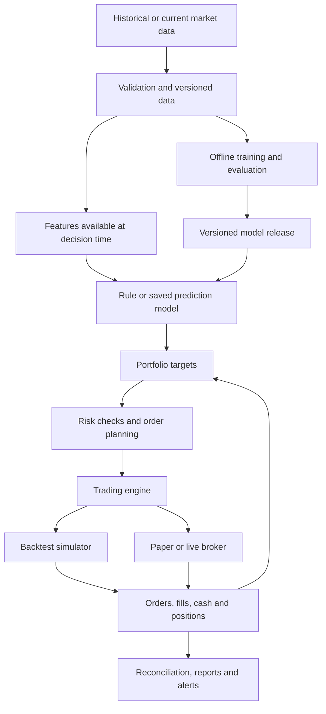

# BuffetBot build proposal and wargame

The [North Star](../NORTHSTAR.md) is the reviewed primary product and architecture reference. The [development backlog](development/README.md) turns that direction into implementation stories. This proposal preserves supporting research and earlier alternatives; the North Star takes precedence for the selected direction.

Prepared September 7, 2026. This is a proposal for discussion, not a record of implemented capabilities or validated investment performance. Provider facts were checked against the linked documentation; architecture choices and promotion criteria below are recommendations.

The later [MVP technical design](mvp-technical-design.md) refines these provisional choices, including evaluating Lumibot first and using the existing local Ollama installation.

## Objective and starting assumptions

Build a reusable laboratory that can turn a market hypothesis into a reproducible experiment, compare strategies fairly, and run selected strategies through a broker with operational controls. Learning, engineering reliability, and investment performance need separate measures of success.

No algorithm can guarantee trading profits. High guaranteed investment returns are not a sound project assumption. [Investor.gov explains investment risk and return guarantees](https://www.investor.gov/protect-your-investments/fraud/protect-your-money).

Provisional scope, pending the owner's market, jurisdiction, budget, and risk preferences:

- US listed, liquid, unleveraged ETFs; daily observations and holdings lasting days or weeks.
- A small, explicitly documented universe, chosen before evaluating strategies. Selecting today's surviving ETFs still introduces selection bias; this is an engineering starting universe, not proof of a general stock-selection edge.
- Long positions and cash, with no borrowing, short selling, derivatives, or intraday latency competition in the first release.
- Local research and paper trading first; one account and one executing strategy initially. Other strategies can run in shadow mode, recording what they would do.
- Python strategy and feature code. An established trading engine handles simulation and broker events.
- One deployable application with durable storage and an external health monitor. Add services only when a measured need justifies them.

The account country determines broker eligibility and relevant account rules. Do not infer it from this computer's timezone. The owner must set eventual live capital, acceptable losses, and exposure limits before any live release.

## Economic reality

Use this accounting identity when assessing a strategy:

`net trading P&L = gross trading P&L - execution costs - financing/borrow costs`

Then subtract data, hosting, software, and applicable taxes when assessing the owner's economic result. Model costs that do not apply as zero and state why. Avoid counting spread twice when it is already embedded in simulated bid/ask fills.

Illustration only: a hypothetical 10% annual return on $10,000 is $1,000 before costs and taxes. A $100 monthly research stack costs $1,200 annually. Neither return nor platform spending implies an edge. Track research spending separately from capital allocated to trading.

Before researching a strategy, write down the proposed mechanism, the reason an opportunity might persist after costs, and what would disprove it. Predictive association does not establish a causal explanation of the market.

## Platform decision

The research engine, data vendor, broker, and broker terminal are different components. They need not come from the same company.

| Candidate | Proposed role | Decision factors |
| --- | --- | --- |
| QuantConnect LEAN | First engine to evaluate for Python backtesting and execution | An existing engine reduces the amount of simulator and order-handling code we must maintain. LEAN is open source; its documented CLI workflow requires a paid organization tier. Data and hosted services have separate access conditions. |
| Alpaca | Provisional first paper broker for US equities | Paper accounts use the same API specification as live accounts with separate credentials/endpoints. Feed coverage and simulated fills require explicit treatment. Live eligibility remains to be checked for the owner's account. |
| Interactive Brokers | Candidate if broader markets or account requirements justify it | Evaluate its TWS API through Trader Workstation or IB Gateway, including login/session recovery and data permissions. Paper execution can differ from live execution. |
| MT5 through a selected broker | Candidate if the owner prefers its instruments and broker | MT5 is a terminal/platform, not the broker. Its official Python integration communicates with a running terminal; published Python wheels are Windows x86-64. Plan a Windows execution host for that integration. |

Sources: [LEAN engine](https://www.quantconnect.com/docs/v2/lean-engine/getting-started), [LEAN CLI requirements](https://www.quantconnect.com/docs/v2/lean-cli/backtesting/deployment), [LEAN Alpaca integration](https://www.quantconnect.com/docs/v2/lean-cli/live-trading/brokerages/alpaca), [Alpaca paper trading](https://docs.alpaca.markets/us/docs/paper-trading), [IBKR TWS API](https://www.interactivebrokers.com/docs/tws-api/doc/introduction), [IBKR paper limitations](https://www.interactivebrokers.com/docs/tws-api/doc/notes-limitations/limitations/paper-trading), [MT5 Python integration](https://www.mql5.com/en/docs/python_metatrader5), and [MetaTrader5 package distributions](https://pypi.org/project/metatrader5/).

For MT5, a second architecture is Python model training followed by export of a compatible model to ONNX for an MQL5 Expert Advisor. MetaQuotes documents [ONNX model validation in the Strategy Tester](https://www.mql5.com/en/docs/onnx/onnx_test). That requires compatible model operations and matching preprocessing. Do not assume a Python script using the terminal API runs unchanged in MT5's Strategy Tester. Confirm whether a broker's instruments are exchange-traded shares, FX, CFDs, or something else, and model that exact contract.

Run one bounded engine evaluation before committing: import a small dataset, run a baseline with configured fees and fills, produce a report, load a saved Python model, and demonstrate paper order events and restart recovery. If CLI cost or dependencies are unsuitable, assess direct LEAN deployment against a smaller Python alternative. Do not start by writing a general trading engine.

## How the program would work

Example daily cycle:

1. After the market session, ingest finalized daily bars and verify their completeness and availability time.
2. Reconcile broker positions, cash, and outstanding orders with local records.
3. Compute features from information available by the decision cutoff.
4. Run a strategy or a pinned model and produce desired portfolio weights with an expiry time.
5. Convert the weights into orders, accounting for current holdings, outstanding orders, buying power, rounding, and costs. Apply portfolio limits.
6. Submit eligible orders during the next configured session. A signal that depends on the finalized close cannot claim an execution at that same close.
7. Persist acknowledgments and fills, reconcile actual holdings, and report decisions, costs, exposures, errors, and P&L.

For an illustrative next-opening-auction strategy, check the selected broker's auction order support and submission deadlines. If execution instead occurs after the open, use that timing and price convention in the backtest. A daily OHLC bar does not reveal the intraday path or prove a limit order would fill.

Modes should be explicit: historical backtest, recorded-event replay, paper execution, and eventually live execution. Share signal, feature, portfolio, and risk code across modes, while acknowledging that broker behavior and simulated fills differ.

Suggested responsibility boundaries:

| Module | Responsibility |
| --- | --- |
| Data adapters and validation | Ingestion, timestamps, normalization, corporate actions, provenance, quality reports |
| Features | Deterministic transformations using only available data |
| Strategies | Produce signals or targets without direct broker access |
| Portfolio | Combine signals and enforce allocation constraints across strategies |
| Risk and execution | Validate order intentions, track pending exposure, submit through the engine |
| Broker adapter | Translate broker events; preserve native IDs, status, and rejection reasons |
| Research | Training, time-based evaluation, experiment tracking, comparisons |
| Operations | Durable event history, account reconciliation, health checks, alerts, recovery |

Keep analytical history in Parquet and query it with DuckDB; it [reads and writes Parquet directly](https://duckdb.org/docs/stable/data/parquet/overview). Use a transactional store for operational state. Begin experiment tracking with immutable run manifests; introduce [MLflow tracking](https://mlflow.org/docs/latest/ml/tracking) when model comparisons warrant it. Preserve the engine's order state rather than creating competing order managers.

## Getting useful historical data

For a first daily US equity experiment, evaluate Alpaca historical bars. Choose the feed and adjustment explicitly, paginate completely, and cache the responses. The API's output is sorted by symbol and time, so a multi-symbol request is not necessarily complete after one page. [Historical bars reference](https://docs.alpaca.markets/us/reference/stockbars).

Alpaca distinguishes IEX, a single exchange, from SIP, consolidated US exchange data. Its documentation permits unsubscribed historical SIP requests when the end time is at least 15 minutes old, while current SIP data requires the appropriate subscription. Select the feed explicitly and verify the account's entitlements. Do not train volume features on consolidated data and silently supply IEX-only volume in execution. [Market data FAQ](https://docs.alpaca.markets/us/docs/market-data-faq).

For broader stock-selection research, require delisted securities, historical symbol mappings, and universe membership known on each historical date. Norgate advertises these capabilities at specified subscription levels; verify local access/platform compatibility, coverage, licensing, and budget before choosing it. [Norgate FAQ](https://norgatedata.com/data-package-faq.php). For later intraday work, evaluate specialist feeds such as [Databento](https://databento.com/docs) against the exact venue and quote/trade coverage required. A brand name alone does not establish dataset suitability.

Minimum stored fields and metadata:

- Instrument identifier and contemporaneous symbol mapping; currency and venue/session identity.
- Bar start/end and session date, timezone convention, and the time the record became usable.
- Open, high, low, close, volume; feed, interval, and adjustment policy.
- Raw price history plus corporate-action events and explicitly derived adjusted views.
- Provider, request parameters, retrieval time, schema version, and content checksum.
- Coverage, missing sessions, duplicates, revisions, listing periods, and relevant usage rights.

Validate OHLC consistency, sorted unique records, exchange calendars including shortened sessions, and unexpected gaps. Never fabricate pre-inception history. Do not silently forward-fill missing prices into tradable bars. When historical publication/revision times are unavailable, record that limitation and use a conservative availability convention; retrieval today does not prove a record existed in that form historically.

Apply splits and dividends consistently to holdings, cash, features, and benchmarks. Adjusted prices are useful for some research calculations but are not executable quote prices. Avoid adding dividend cash flows twice. Fundamentals, macro releases, and news later require publication times and historical vintages, not just fiscal dates or today's revised numbers.

## Trustworthy backtesting

A backtest replays the information and actions that could have occurred at each date. It is evidence about a specified simulation, not proof of future returns.

Use chronological training, validation, and final test periods. Fit imputation, scaling, feature selection, and model parameters only on training data. Scikit-learn documents both [time series splitting](https://scikit-learn.org/stable/modules/generated/sklearn.model_selection.TimeSeriesSplit.html) and [preprocessing leakage](https://scikit-learn.org/stable/common_pitfalls.html).

For example, train on an earlier window, select settings on the next window, and evaluate once on a later window. Roll forward and repeat with only past data. Remove training examples whose future-return label interval overlaps the evaluation period; a generic date split alone does not do this. Split panel data by date across all symbols. Tune ensemble weights using predictions made on data excluded from the underlying model's training.

Before inspecting results, record the universe, hypothesis, feature set, parameter search budget, evaluation periods, costs, benchmark, and rejection criteria. Preserve every trial. Repeatedly inspecting a final test set turns it into development data. Freeze the release candidate before final evaluation and reserve future observations for subsequent confirmation.

Configure brokerage-specific commissions, fees, spread/slippage assumptions, order timing, buying power/settlement rules, liquidity limits, and applicable financing. LEAN exposes [fill models](https://www.quantconnect.com/docs/v2/writing-algorithms/reality-modeling/trade-fills/key-concepts); defaults must be checked against the strategy. Stress results with wider costs, delayed execution, missed trades, different periods, and nearby parameter values.

Every experiment report should include:

- Net return, benchmark return, and exposure; compare like-for-like reinvestment, cash treatment, and dates.
- Maximum drawdown: the largest peak-to-trough portfolio loss, plus recovery duration.
- Volatility and risk-adjusted performance, with assumptions and uncertainty estimates that respect time dependence.
- Turnover, number of decisions/trades, average holding period, cost sensitivity, and worst periods.
- Contribution by asset and market period; sensitivity to removing exceptional trades or winners.
- Full configuration, data and model identifiers, code revision, random seeds, and trade ledger.

Use cash, buy-and-hold, and a simple allocation rule as controls. Compare risk and exposure as well as raw returns. A high win rate alone says little: many small gains can be overwhelmed by rare large losses. More symbols observed on the same day do not provide the same evidence as independent market histories.

## Strategy and model experiments

Start with a baseline that checks the accounting, then test a small number of explicit hypotheses:

| Experiment | Hypothesis to investigate | Main failure scenario |
| --- | --- | --- |
| Buy-and-hold / fixed allocation | Provides a benchmark and accounting control | Mistaking broad market exposure for strategy skill |
| Simple trend rule | Price persistence may outweigh whipsaw and trading costs | Sideways markets trigger repeated reversals |
| Simple mean reversion | Some temporary moves may reverse enough to cover costs | A sustained move continues against the position |
| Supervised model | Several measurements may improve a defined return or ranking forecast | Leakage, overfitting, unstable relationships, excess turnover |
| Text-derived feature, later | Timely disclosures may add incremental information | Stale news, incorrect extraction, revised text, model contamination |

These are experiments, not assertions that the strategies have a profitable edge.

Define the prediction task before selecting a model. For example: after today's close, estimate the next five-session return starting at the next executable price, or rank the eligible assets by that return. Keep labels consistent with the actual holding and execution rules. Evaluate forecast quality and the resulting portfolio P&L after costs separately.

Begin with a regularized linear model and a small tree-based model. With a handful of ETFs and daily data, sample size and market diversity are limited. Add capacity only if it improves untouched evaluations. A profitable result need not use machine learning.

Wiring several models means defining contracts, not having several chatbots vote on a trade. A return model can output an expected return, a volatility estimator can inform position sizing, and an optional regime model can influence allocations. All predictions carry an instrument ID, decision timestamp, horizon, expiry, and model version. A deterministic portfolio layer handles constraints and the option to hold cash. Validate any uncertainty estimates; a model's confidence score is not automatically a reliable probability.

First test one model. Then add one component at a time and measure its incremental contribution against the simpler system. Account for correlated signals and aggregate exposures before sending any order.

Training fits model parameters to examples. Hyperparameter tuning chooses settings through validation. Fine-tuning adapts an already trained model using task-specific examples. Fine-tuning is optional for this project and is not a prerequisite for numerical trading models.

If we later fine-tune a language model, give it a narrow task such as extracting whether management raised, maintained, or lowered guidance, with evidence spans from a timestamped document. Build labeled examples and a held-out evaluation, compare against a prompt-based baseline, and measure downstream value after inference cost and delay. A modern pretrained model may know events after a historical test date; prompting it to pretend otherwise does not remove that contamination. Use auditable model cutoffs where possible and prospective evaluation where they cannot be established.

Treat external text as data. Text-processing models should not receive broker credentials, change risk limits, or execute embedded instructions. Missing or invalid outputs cause abstention. This keeps model evaluation separate from execution authority.

Retraining can eventually run automatically on a schedule using only fully observed labels. Save candidate weights, preprocessing, feature schema, training cutoff, data version, and evaluation results. Deploy a pinned version with rollback. Automatic model promotion is a later capability that needs its own acceptance tests; the first releases promote selected candidates deliberately.

## Wargame: what breaks and how we respond

| Scenario | Required experiment or response |
| --- | --- |
| Excellent backtest disappears on later dates | Audit leakage and trial selection; retain the simpler baseline and reject the candidate if evidence does not survive. |
| Profit disappears when execution costs increase | Run a cost sweep; reduce turnover only as a new documented hypothesis, or reject the strategy. |
| Trend strategy repeatedly loses in a range | Attribute losses by market period and check predeclared drawdown limits. Do not relabel the strategy after seeing results. |
| Market gaps through an exit level or halts | Simulate unavailable execution and gap fills. Position sizing limits exposure; a stop price is not a guaranteed loss cap. |
| Data is stale, missing, duplicated, or implausible | Stop new exposure, record the fault, and follow the existing-position policy. Resume after verified recovery. |
| Broker accepts an order but the request times out | Look up the existing order using its persistent identity and reconcile before retrying. Never blindly resubmit. |
| Process crashes after submitting an order | Recover durable intent, query broker orders/positions/fills, reconcile discrepancies, then decide whether it can resume. |
| An order only partially fills | Update targets using filled and remaining quantities; avoid duplicate replacement exposure. |
| A cancellation acknowledgment is delayed and a fill arrives | Reconcile the actual execution before sizing or submitting a replacement. |
| Two instances start at once | Enforce one active order writer with a durable lease/fencing design; test failover. |
| Local positions disagree with the broker | Suspend new orders and reconcile; preserve both histories for diagnosis. |
| A model release is corrupt, incompatible, or expired | Fail validation and abstain; load a previously validated version only under the defined rollback policy. |
| Several strategies take the same economic exposure | Enforce limits at account/portfolio level, including pending orders. |
| The broker or network remains unavailable | Stop new exposure, alert, and follow the outage policy. Record that unreachable positions cannot necessarily be closed. |
| Nothing beats the benchmark robustly | Keep the laboratory as a learning tool; do not fund a strategy to meet a deadline. |

Risk configuration must define allowed instruments, position and gross exposure caps, pending-order exposure, available cash rules, maximum order size, order frequency, data freshness, daily-loss and drawdown responses, and recovery criteria. Exact values depend on the eventual capital and strategy; this proposal does not select them for the owner.

Differentiate pausing new orders, cancelling pending orders, and liquidating positions. They have different effects, and liquidation may fail or be costly. Every automated response needs an explicit existing-position policy. Software controls can limit actions but cannot guarantee an absolute maximum loss through gaps, outages, or execution failure.

Alpaca's paper simulator omits effects including market impact, latency slippage, queue position, regulatory fees, and dividends. Paper trading is useful for testing integration, with these limitations recorded in comparisons. [Paper simulation details](https://docs.alpaca.markets/us/docs/paper-trading).

## Implementation milestones and acceptance criteria

Advance on evidence rather than an arbitrary calendar deadline. Deployment speed and evidence of investment performance are separate milestones.

| Milestone | Deliverable | Acceptance criterion |
| --- | --- | --- |
| 0. Scope and engine evaluation | Market/account assumptions, engine choice, exact instrument/feed/execution convention | A small backtest works with explicit costs; model loading and broker paper events are feasible within budget. |
| 1. Data and accounting baseline | Versioned dataset, quality report, benchmark strategy, reproducible report | Fresh checkout can reproduce the result from an authorized cached dataset; hand-worked fills, split, and dividend examples reconcile. |
| 2. Strategy test bed | Shared strategy contract, configuration-driven runs, chronological evaluation, comparison report | Two simple strategies run through the same pipeline; future-data access and same-close execution errors are checked. |
| 3. Paper operations | Broker adapter/configuration, durable events, risk enforcement, health monitor, recovery runbook | Timeout, duplicate event, partial fill, restart, cancellation race, stale feed, and account mismatch drills behave as specified. |
| 4. ML experiment | One prediction target, simple models, reproducible training, candidate registry | Leakage audit passes; report incremental performance and uncertainty versus the rule baseline after costs. Rejecting the model is a valid result. |
| 5. Small live pilot, conditional | Owner-selected capital and limits; explicit live release configuration | Account eligibility/permissions checked, technical drills passed, strategy evidence reviewed, and owner authorizes that concrete release. |
| 6. Further automation and scaling | Multiple strategies, controlled retraining/promotion, measured execution costs | Evidence supports additional complexity; portfolio limits and capacity checks hold as size changes. |

Paper observation should cover enough operating events to exercise the system; a few quiet weeks do not validate a slow strategy's investment edge. Any small live pilot measures real operational and execution behavior as well as investment results. Scaling remains a separate decision.

Initial automated checks should target accounting, timestamp leakage, order lifecycle, risk enforcement, and deterministic replay. Use hand-worked fixtures for splits/dividends and order transitions. Do not make tests assert that a strategy must earn money on a particular historical sample.

For quick deployment, pin the environment, package the chosen engine and application, run it under a supervisor on one host with persistent storage, and monitor its heartbeat externally. Keep paper and live identities separate. Logs must exclude credentials. Document backup/restore, market calendars, reconnect behavior, reconciliation, pausing, and rollback. A dashboard comes after the event ledger and reports are trustworthy.

## First concrete build

The first implementation should download and validate a small daily dataset, run a buy-and-hold control plus one simple rule through the selected engine, and save a reproducible report with net returns, drawdown, costs, and a trade ledger. This establishes the data and accounting foundation for the strategy test bed. Broker paper execution is the next extension of that same path.

Still open: preferred market and holding period; account country and existing broker; monthly data/hosting budget; eventual live capital and acceptable losses; and preference for managed services versus operating a local engine. These affect vendor and deployment choices, but do not prevent specifying the research and execution contracts.
