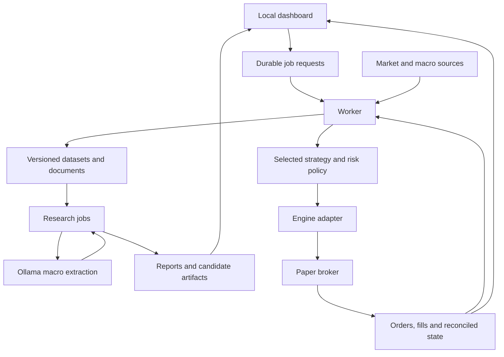

# BuffetBot MVP technical design

The [North Star](../NORTHSTAR.md) is the reviewed primary product and architecture reference. The [development backlog](development/README.md) defines the implementation stories and release evidence. This document supplies supporting implementation detail; align it with the North Star if a conflict arises.

Proposed September 7, 2026. This document describes the target architecture. [BB-001](development/01-project-foundation.md) provides the verified local Python/configuration foundation, [BB-002](development/02-engine-qualification.md) qualifies the engine with synthetic experiments, [BB-003](development/03-contracts-and-experiments.md) implements the shared contracts, and [BB-004](development/04-dataset-snapshots.md) implements local market snapshots and offline fixtures. Actual provider ingestion, production trading, model, and broker integration work remains planned. It refines the earlier [build proposal](build-proposal.md), particularly the engine choice and local model deployment.

## Product boundary

The MVP is a local application that compares trading strategies, explains their decisions, and operates one selected strategy in a broker paper account. The first hybrid comparison combines a simple trading rule, numerical market measurements, and structured macro features extracted by a local LLM.

Provisional defaults are US ETFs, daily observations, decisions after completed sessions, and trades during the next configured session. Begin with a small fixed research universe and long positions/cash. Market choice and existing broker accounts remain open; MT5 would change the execution adapter and hosting assumptions.

The first release includes data validation, reproducible backtesting, a local dashboard, macro extraction, A/B/C experiment comparison, bounded candidate training, and paper execution/recovery. The LLM-enhanced variants initially operate in shadow mode. Live deployment and automatic model promotion are later milestones with their own release criteria.

## Available development environment

Read-only inspection found Python 3.12.3, a working Docker engine, approximately 64 GB RAM, two RTX 3090 GPUs with 24 GB each, and an existing Ollama installation. Several model weights are already present, including `qwen2.5:14b`.

Start the extraction evaluation with an installed general-purpose model. Benchmark accuracy, latency, memory use, and compatibility before choosing the default. Record the model digest and prompt version for each run. GPU memory capacity does not establish model quality or inference throughput; those have not been measured. Reuse the current Ollama service without modifying unrelated models or workloads.

## Proposed stack

| Part | Choice | Purpose |
| --- | --- | --- |
| Application | Python 3.12, isolated environment, uv lockfile | One language for research, models, adapters, and UI |
| Trading engine | Lumibot 4.5.91, qualified with narrow corrections in BB-002 | Existing simulation and Alpaca integration behind our adapter |
| Data analysis | pandas/NumPy, Parquet, DuckDB | Clean and inspect versioned datasets locally |
| Operational storage | SQLite with transactions and migrations | Jobs, decisions, model registry metadata, order-event audit records |
| Data contracts | Pydantic and explicit domain validation | Validate timestamps, units, bounds, and external/model outputs |
| Dashboard | Streamlit | Experiment controls, performance comparison, source evidence, paper account status |
| Model inference | Existing Ollama service through a provider interface | Local structured extraction with a replaceable provider |
| Numerical ML | scikit-learn | Simple prediction models and preprocessing pipelines |
| Quality and deployment | pytest, Ruff, Docker Compose | Critical behavior checks, consistent environment, persistent volumes |

Lumibot documents [Alpaca integration](https://lumibot.lumiwealth.com/brokers.alpaca.html) and [backtesting with supplied pandas data](https://lumibot.lumiwealth.com/backtesting.pandas.html). [BB-002's decision](development/evidence/BB-002-engine-decision.md) records the tested release, the shipped GPL-3.0 text despite MIT metadata, locked dependencies and demonstrated corrections. Eligible feature selection, dividend entitlement/payment and partial-order startup import need those narrow adapters; unmodified defaults are not qualified.

The earlier LEAN recommendation was provisional. Its current [Alpaca integration source](https://raw.githubusercontent.com/QuantConnect/Lean.Brokerages.Alpaca/master/QuantConnect.AlpacaBrokerage/AlpacaBrokerage.cs) performs external subscription validation. BB-002 demonstrated a local Lumibot workflow that avoids that dependency; actual broker integration is still required later.

Other relevant documentation: [uv environment locking](https://docs.astral.sh/uv/concepts/projects/sync/), [Streamlit execution model](https://docs.streamlit.io/get-started/fundamentals/main-concepts), and [Ollama structured output](https://docs.ollama.com/capabilities/structured-outputs). Schema-conforming output still needs factual evaluation.

## Process boundaries

Use one codebase with a dashboard process and a worker process. Run expensive research in isolated child processes so it does not block order-event handling. The worker is the only process allowed to send broker orders. Dashboard actions submit uniquely identified job requests; browser refreshes cannot execute trades. SQLite can support this small local command queue without adding a separate queue service.

The engine owns its order lifecycle; our adapter records events and exposes reconciliation results. Do not build a competing order manager. Keep research and inference failures from blocking execution of an already selected numerical strategy.

Persist datasets, artifacts, and operational state on mounted local volumes. Bind interfaces locally by default. Broker credentials belong in local environment configuration and are excluded from Git, research processes, model prompts, and logs. The MVP execution adapter accepts paper configuration only.

## Contracts that make strategies replaceable

The implemented v1 records, binding checks, canonical experiment identity and examples are documented in the [contract guide](contracts.md). The [dataset guide](datasets.md) documents immutable market storage, quality checks and verified experiment binding. Job/artifact storage, policy formulas and provider/engine adapters remain later integrations against that boundary.

| Record | Required meaning |
| --- | --- |
| Market observation | Instrument, session, bar interval, raw OHLCV, feed, adjustment policy, availability time, dataset version |
| Source document | Source URL, publication time, first observation time, content hash, original text |
| Macro assessment | Source IDs and exact supporting spans, comparison document IDs, extracted categories, ambiguity/unknown status, expiry, model/prompt versions |
| Strategy context | Decision cutoff, eligible data, current and pending exposure, configuration, optional validated macro features |
| Portfolio target | Instrument weights, decision time, expiry, strategy version and reason codes |
| Execution event | Stable local intention ID, broker ID, event ID/status, filled quantity and price, timestamps |
| Experiment manifest | Code revision, data/model/prompt identifiers, dates, cost assumptions, settings, seeds, and artifacts |

A strategy implements one core operation: `generate_targets(context) -> PortfolioTargets`. The engine adapter supplies an equivalent context in backtests and paper execution. Shared signal logic does not imply identical fills.

Reject NaNs, invalid weights, unsupported instruments, future observations, stale model outputs, and inconsistent timezones. Represent monetary/quantity values precisely at accounting and broker boundaries. Infer neither an executable price from an adjusted series nor a probability from an LLM's uncalibrated confidence score.

## Data and first experiment

Use Alpaca historical bars with the feed and adjustments selected explicitly. Cache responses and paginate completely. A daily strategy can consume completed historical SIP bars after the documented delay rather than requiring a current consolidated feed. Current free IEX data has different coverage, so quote validation and execution assumptions must identify that distinction. [Alpaca data FAQ](https://docs.alpaca.markets/us/docs/market-data-faq).

Use official central-bank statements for the first text task. Add a small number of macro series through FRED/ALFRED, retaining historical vintages and actual release availability. [FRED and ALFRED distinction](https://fred.stlouisfed.org/docs/api/fred/fred_vs_alfred.html). If a document's historical revision timing is unknown, record the limitation. Supply synthetic fixtures for an offline demonstration and label their results as synthetic.

The first trading rule is a fixed moving-average trend rule with parameters declared before evaluation. Use a buy-and-hold control, completed observations, explicit costs, dividends/splits, and an execution convention the broker can actually support. A signal after today's close executes no earlier than the next eligible session. The engine evaluation must verify this behavior.

Compare independently accounted portfolios with identical starting capital and common execution assumptions:

- A: the trend rule with fixed allocation policy.
- B: the same rule with a predefined numerical volatility adjustment.
- C: B with an experimental macro adjustment derived from structured LLM output.

C's mapping from extracted information to allocation is an explicit, bounded research policy. The LLM does not choose its own trading authority. Freeze mappings before test evaluation and record all variants. These comparisons test incremental value; they do not presume the hybrid wins.

Select only one strategy for the actual paper account. Other variants maintain separate shadow ledgers. Label broker paper results, historical simulations, and shadow estimates distinctly. Record simulator omissions rather than treating paper fills as evidence of achievable live execution.

## LLM and candidate training

First task: compare two central-bank statements and extract the direction of policy language and changes in stated concerns, with source spans. Include an unknown outcome. Start with prompt-based extraction, short bounded inputs, caching, timeouts, and strict parsing. Preserve source text and evaluated outputs for replay rather than rerunning a stochastic model during a supposedly identical backtest.

Build a small human-labeled evaluation set covering unchanged language, conditional statements, conflicting evidence, and missing context. Score correctness, evidence support, invalid-output rate, runtime, and downstream effect. Historical LLM experiments remain exploratory where training-data cutoffs cannot be audited; begin recording prospective predictions immediately.

Implement one candidate-training job after the baseline works: fit a simple numerical model using past observations and fully matured future-return labels, evaluate on later dates, and write a versioned candidate artifact. Remove training examples whose label windows overlap evaluation. Split all assets by date and fit preprocessing on training data only.

The job evaluates a declared, bounded set of settings. Record rejected candidates as well as successful ones. It writes a candidate; it does not replace the deployed model. Fine-tuning the language model and automatic promotion become later experiments after extraction quality and promotion criteria are established.

## First screens and acceptance criteria

The dashboard should expose four views: experiment setup/results, macro evidence, paper account/activity, and candidate comparisons. Every view should identify its mode, data freshness, and relevant versions. Pause behavior must say whether it only blocks new orders; cancellation and liquidation are separate operations.

Implement in this order:

1. Evaluate the engine: isolated installation, supplied-data backtest, next-session timing, explicit costs, hand-worked split/dividend accounting, model loading, and paper adapter configuration. Record dependency compatibility. If a required behavior fails, resolve it before building the rest around that engine.
2. Deliver the first complete path: dataset ingestion/validation, control plus trend backtest, persistent manifest/trade ledger, and dashboard report. Repeating a run on the same snapshot reproduces its outputs.
3. Add macro ingestion/extraction and the A/B/C comparison. Every extraction links to evidence; invalid or missing output follows an explicit fallback and is counted in results.
4. Add the candidate-training job and comparisons. Timestamp/label checks prevent known leakage cases; model artifacts are reproducible and versioned.
5. Connect the selected strategy to paper execution. Verify timeout recovery, partial fills, duplicate events, cancellation races, restart reconciliation, stale-data pauses, and rejection of a second order-writing instance.

The MVP is complete when a fresh setup can reproduce the documented demo, compare the strategies, inspect the evidence, train a candidate, and operate/recover the paper workflow using separately configured account credentials. Profitability is not a software acceptance test. Missing credentials permit offline validation but must be reported as blocking broker integration verification.

## Open details

US ETFs and Alpaca remain the proposed defaults. Existing broker/model services may alter adapters. The local dashboard is the default interface. Paper account size, universe, exact cost/execution assumptions, and configurable exposure limits must be stated in the first experiment configuration. These are simulation settings, not an allocation of real capital.
